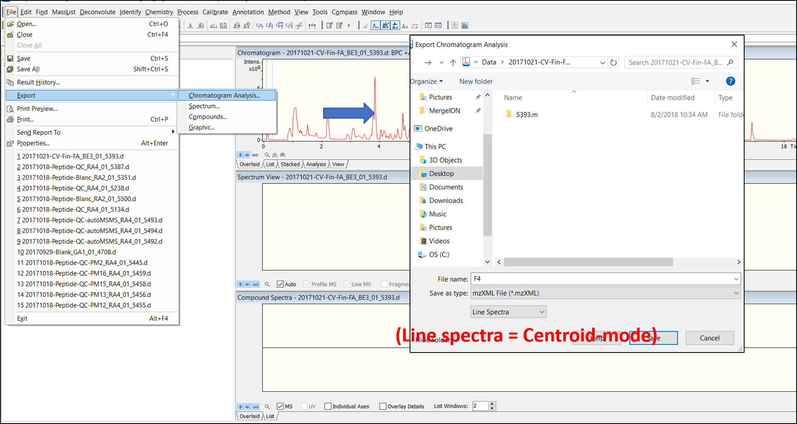
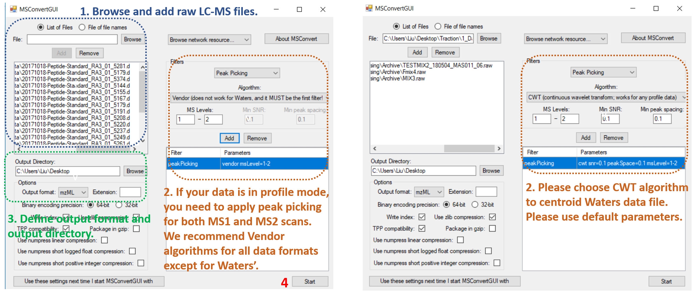

# MergeION: Batch processing of LC-MS/MS data into a spectral library and several additional functions

Tandem mass spectrometry is a technique frequently used for small molecule identification. Automated structure elucidation is usually performed by spectral library search. Building a local high quality spectral library is an essentiel step thus often lacking in metabolomics and pharmaceutical laboratories. This is often due to the data confidentiality (e.g drug metadata) 

Our package fills these gaps and enables building local spectral libraries without sharing them in public domains. It works by extracting MS1 and MS2 scans from one or multiple raw chromatogram files according to m/z (and retention time) provided by users. They are then merged into a GNPS-style spectral library combining user-provided metadata. It is compatible with mzML/mzXML format acquired on Thermo, Water or Bruker instruments, in either DDA (Data-driven acquisition) or targeted MS/MS-mode.

In addition, several spectral search algorithms are available, allowing users to search an unknown spectrum in their local database or public databases (i.e. drug structures in GNPS, MASSBANK and DrugBANK).
  
# Preparation before library generation

## 1. Installation from Github in Rstudio

```R
# Install BiocManager if it has not been installed previously:
if (!requireNamespace("BiocManager", quietly=TRUE))
    install.packages("BiocManager")

# Install MergeION:
Sys.setenv(R_REMOTES_NO_ERRORS_FROM_WARNINGS="true") 
BiocManager::install("daniellyz/MergeION2")
```

## 2. Data format conversion

Raw LC-MS/MS files must be in centroid/line spectra-mode and in mzML, mzXML or mzData format. Such files can be usually exported from LC-MS vendor software, e.g. with Bruker Compass DataAnalysis 4.3:



If such function is not available in vendor software or user want to convert many raw files at the same time, we recommend an alternative solution with MSConvertGUI (part of proteowizard: http://proteowizard.sourceforge.net/download.html). The software is able to batch-convert raw chromatogram files of most vendors' formats into centroid-mode mzML or mzXML files. Following instructions are given for batch-conversion of profile-mode Bruker and Water's chromatograms:



## 3. Preparation of metadata

## 4. Preparation of processing parameters

# Tutorial 1: Generating an in-house spectral library from mzXML
