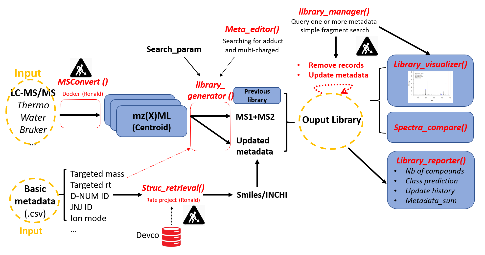
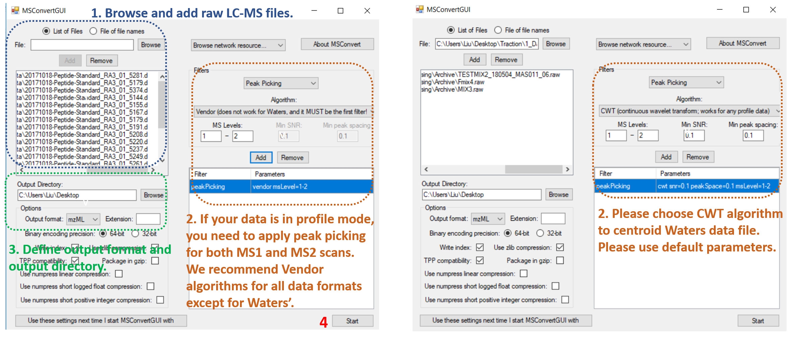
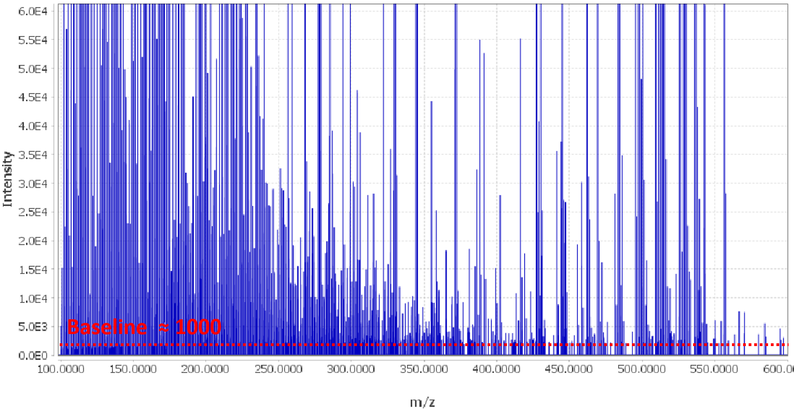
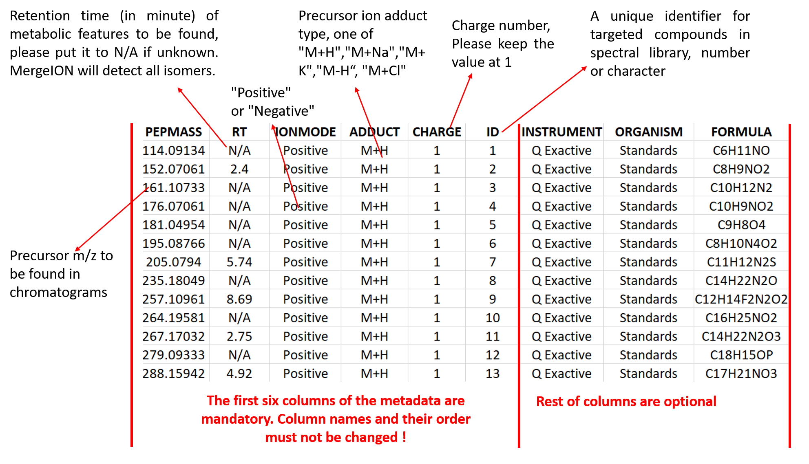

# MergeION: Batch processing of LC-MS/MS chromatograms into a spectral library

In tandem mass spectrometry-based metabolomics, automated structure identification is usually performed by spectral library search and in silico fragmentation (smart algorithms). For both approaches, the missing steps towards automation are the pre-processing and format conversion of raw chromatograms acquired in DDA (Data-driven acquisition) or targeted MS/MS-mode. As for, following steps are usually performed chromatogram by chromatogram, spectrum by spectrum in vendor software & text editors: selecting MS/MS scans, processing spectra, copying them along with metadata (e.g.ion mode, compound name...) into in-house database (for chemical standards) or structure identification software (for unknowns). Our package fills these gaps and enables: i) automated spectral library generation; ii) batch-processing LC-MS/MS data on commonly used structure elucidation software (CSI:FingerID, MSFinder, GNPS and Metfrag).  
MS1 and MS2 scans from one or multiple raw chromatogram files are first extracted according to m/z (and retention time) provided by users. They are then merged into a GNPS-style spectral library and can be later converted to formats compatible with different software tools. The following pipeline shows the key steps achieved by the package:



Following steps need to be performed before using this package:

## 1. Installation from Github in Rstudio

```R
# Install BiocManager if it has not been installed previously:
if (!requireNamespace("BiocManager", quietly=TRUE))
    install.packages("BiocManager")

# Install MergeION:
BiocManager::install("daniellyz/MergeION")
```

## 2. Data format conversion

Raw LC-MS/MS files must be in centroid/line spectra-mode and in mzML, mzXML or mzData format. Such files can be usually exported from LC-MS vendor software, e.g. with Bruker Compass DataAnalysis 4.3:


If such function is not available in vendor software or user want to convert many raw files at the same time, we recommend an alternative solution with MSConvertGUI (part of proteowizard: http://proteowizard.sourceforge.net/download.html). The software is able to batch-convert raw chromatogram files of most vendors' formats into centroid-mode mzML or mzXML files. Following instructions are given for batch-conversion of profile-mode Bruker and Water's chromatograms:



## 3. Check spectra baseline

Mass spectra show usually a baseline caused by chemical noise in matrix or by ion overloading. Users can define such baseline (absolute and relative) for each LC-MS/MS file so that only significant mass peaks are saved. Such filter can reduce spectral library size and improve chemical identification. The baselines can be roughly determined by visualizing MS1 scans in vendor software or MZMine. Data acquired on the same MS instrument usually have similar baseline levels.



## 4. Preparation of metadata

The metadata contains the metabolic features to be extracted from chromatogram(s) and it is. 

It must be a semicolon-separated .csv file where each row represents a targeted metabolic feature (PEPMASS, RT, IONMODE, ADDUCT, CHARGE and ID). Other information of metabolic feature can be added and will be found in the final merged library. A single metadata should be used for batch-processing the list of chromatogram files. The example metadata can be downloaded at https://zenodo.org/record/2581847/files/:



## Example 1: generating an in-house spectral library of drug standards

Please type and select html of Example 1:

```R
browseVignettes("MergeION")
```

