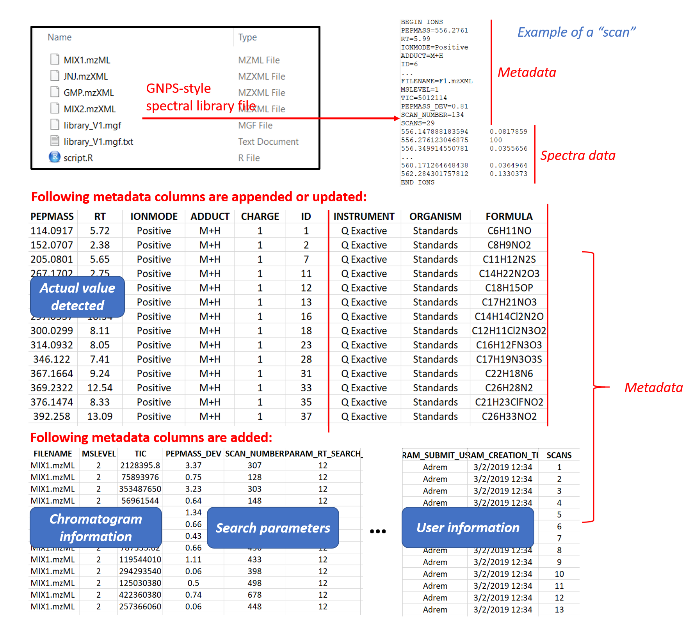
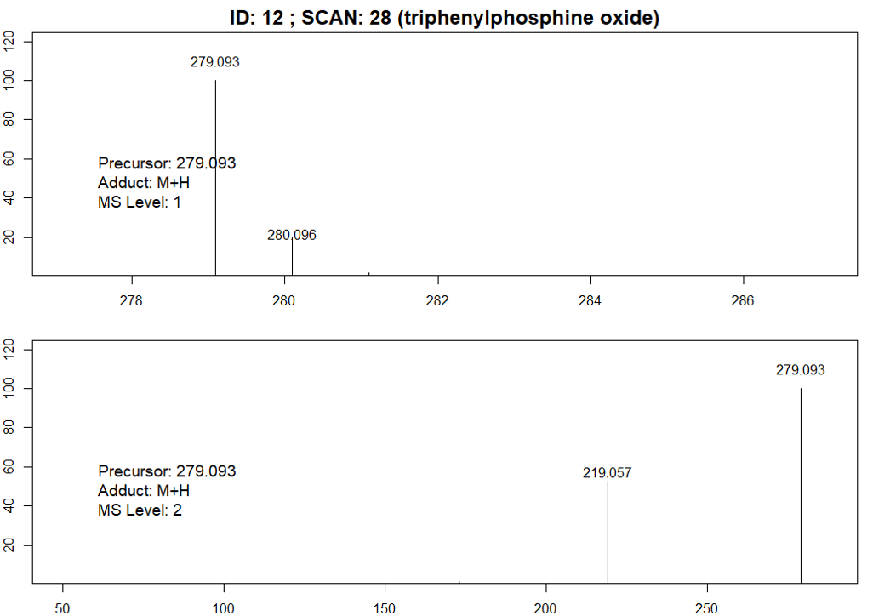
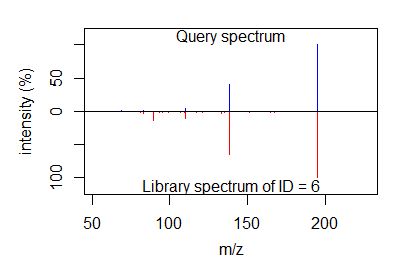
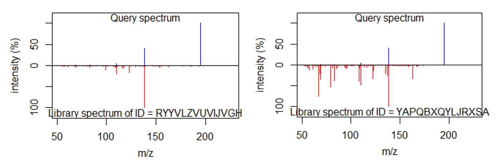
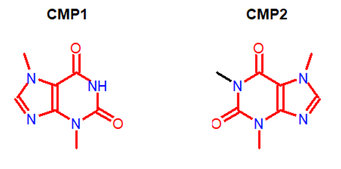

# MergeION: Batch processing of LC-MS/MS data into a spectral library and several additional functions

Tandem mass spectrometry is a technique frequently used for small molecule identification in the pharmaceutical field. Automated structure identification is usually performed by spectral library search and smart algorithms (in silico or machine-learning based). For both approaches, building a high quality spectral library is an essentiel step thus often lacking in the pharmaceutical field. This is often due to the confidentiality of pharmaceutical data (especially drug metadata) and the low availability of drug standards.

Our package fills these gaps and enables building local spectral libraries without sharing them in public domains. It works by extracting MS1 and MS2 scans from one or multiple raw chromatogram files according to m/z (and retention time) provided by users. They are then merged into a GNPS-style spectral library combining user-provided metadata. It is compatible with mzML/mzXML format acquired on Thermo, Water or Bruker instruments, in either DDA (Data-driven acquisition) or targeted MS/MS-mode.

In addition, several spectral search algorithms are available, allowing users to search an unknown spectrum in their local database or public databases (i.e. drug structures in GNPS, MASSBANK and DrugBANK).
  
# Preparation before library generation

## 1. Installation from Github in Rstudio

```R
# Install BiocManager if it has not been installed previously:
if (!requireNamespace("BiocManager", quietly=TRUE))
    install.packages("BiocManager")

# Install MergeION:
BiocManager::install("daniellyz/MergeION2")
```

## 2. Data format conversion

Raw LC-MS/MS files must be in centroid/line spectra-mode and in mzML, mzXML or mzData format. Such files can be usually exported from LC-MS vendor software, e.g. with Bruker Compass DataAnalysis 4.3:


If such function is not available in vendor software or user want to convert many raw files at the same time, we recommend an alternative solution with MSConvertGUI (part of proteowizard: http://proteowizard.sourceforge.net/download.html). The software is able to batch-convert raw chromatogram files of most vendors' formats into centroid-mode mzML or mzXML files. Following instructions are given for batch-conversion of profile-mode Bruker and Water's chromatograms:


## 3. Check spectra baseline

Mass spectra show usually a baseline caused by chemical noise in matrix or by ion overloading. Users can define such baseline (absolute and relative) for each LC-MS/MS file so that only significant mass peaks are saved. Such filter can reduce spectral library size and improve chemical identification. The baselines can be roughly determined by visualizing MS1 scans in vendor software or MZMine. Data acquired on the same MS instrument usually have similar baseline levels.


## 4. Preparation of metadata

The metadata contains the metabolic features to be extracted from chromatogram(s) and it is. 

It must be a semicolon-separated .csv file where each row represents a targeted metabolic feature (PEPMASS, RT, IONMODE, ADDUCT, CHARGE and ID). Other information of metabolic feature can be added and will be found in the final merged library. A single metadata should be used for batch-processing the list of chromatogram files.


# Tutorial 1: Generating an in-house spectral library of drug standards

The datasets for Tutorial 1 are provided by Janssen Pharmaceutica. It consists of known standard pharmaceutical compounds for which high quality Q-Exactive MS/MS data is provided. Names and structures of these compounds can be found in the metadata. All datasets were acquired in positive ion mode through either DDA (data-dependent acquisition) or targeted MS/MS. Raw data in profile mode were converted into centroid-mode mzML or mzXML files using MSConvertGUI. Please execute following commands (once only) to download raw datasets.

```R

# Download raw chromatogram data and rename the files:

url = "https://zenodo.org/record/2581847/files/"
original_files = c("TESTMIX2_180504_MAS011_06.mzXML",
                   "JNJ42165279_171214_MAS006_14.mzXML",
                   "GMP_R601592_150925_MAS006_04.mzXML")
download.file(paste0(url,original_files[2]),destfile="MIX2.mzXML")
download.file(paste0(url,original_files[3]),destfile="JNJ.mzXML")
download.file(paste0(url,original_files[4]),destfile="GMP.mzXML") 

# Download metadata and rename the files:

url2 = "https://raw.githubusercontent.com/daniellyz/MergeION/master/inst/library_metadata.csv"
download.file(url2,destfile="library_metadata.csv") # Download and rename the files

```
## Building the first spectral library: library1

```R
raw_data_files = c("MIX2.mzXML","JNJ.mzXML")
metadata_file = "library_metadata.csv"

mslevel = c(1,2) # Both MS1 and MS2 scans are extracted!
MS2_type = c("DDA","Targeted") # Mode of MS/MS experiment for the three files
adduct_type = "Default" # Only looking for default ion types (ion types provided by users in metadata)
max.charge = 1
screener = FALSE # Since metadata is provided, no peak picking from MS1 scan is not necessary
screener.mode = "XCMS" 

isomers = F # If isomers are present, only the peak with higher TIC is extracted.
normalized = T # Spectra are normalized to the highest peak
rt_search = 12 # Retention time tolerance (s)
ppm_search = 10  # Mass tolerance (ppm)
baseline = 1000  # Baseline level 1000 is fixed for 3 datasets.
relative = 1 # Relative intensitiy level 1% is fixed. All peaks under both baseline and relative level are considered as noise.
snthreshold = 0 # Only used for chromatogram peak picking, here not useful
max_peaks = 100 # Maximum number of abundant peaks kept 

write_files = F # The library(mgf) and metadata will not be writen in user's folder
input_library = "" # A brand new library, there's no previous dependency
output_library = "library_V1.mgf" # Name of the library
user_name = "Adrem" # User name for uploading

library1 = library_generator(raw_data_files, metadata_file, mslevel, screener, screener.mode, MS2_type, isomers, adduct_type, max.charge, rt_search, ppm_search, baseline, relative, snthreshold, max_peaks, normalized, user = user_name, write_files, input_library, output_library)

library1 = library1$complete # Important! We extract the library object. "$complete" for extracting the entire library including historical mass spectra. Here since we create a brand-new library, "library1$complete" and "library1$current" are the same. 

```
## Writing library files

```R
# Writing the library (.mgf):
output_library = "library_V1.mgf" 
writeMGF2(library1,output_library) 

# Writing metadata as excel file:
output_metadata = paste0(output_library,".txt") 
write.table(library1$metadata,output_metadata,col.names = T,row.names=F,dec=".",sep="\t")
```
Two files are added in the working directory: 1) The library file "library_V1.mgf". The library format is inspired from GNPS database (https://gnps.ucsd.edu/ProteoSAFe/static/gnps-splash.jsp) and it consists of both metadata and spectra data. The "scans" are copies of MS1/MS2 spectra detected in raw LC-MS/MS files together with user-provided metadata. For MS1 scans, only the part of spectrum where isotopic patterns are located is saved. Segment of spectrum that contains fragments and precursor ion are saved for MS2 scans. 2) Metadata file "library_V1.mgf.txt", a tab-separated that can be read into a matrix in Excel. It contains metadata of all targeted scans (MS1 and MS2) with additional information: 

* FILENAME: from which file the metabolic feature is detected
* MSLEVEL: 1: MS1 scan or 2: MS/MS scan
* TIC: Total ion intensity of scans before normalization
* PEPMASS_DEV: Mass deviation (ppm) of precursor m/z to what is in user-provided targeted m/z
* SCAN_NUMBER: scan number in original LC-MS/MS chromatogram
* PARAM_...: parameters used to extract current scan
* PARAM_CREATION_TIME: the time when the record is added to the library
* SCANS: integer, a unique identifier for each record in the library



## Update the spectral library

Now we process and add a new data GMP.mzXML in the existing library as another user. Following metadata are changed:

```R
raw_data_files = "GMP.mzXML"

adduct_type = c("M+H", "M+Na") # Two adduct types are now considered
MS2_type = "Targeted"
isomers = T # We would like now to record all isomers in the library

write_files = T # We want to directly write the library mgf + metadata files
input_library = library1
output_library = "library_V2.mgf"
user_name = "Daniel"

library2 = library_generator(raw_data_files, metadata_file, mslevel, screener, screener.mode, MS2_type, isomers, adduct_type, max.charge, rt_search, ppm_search, baseline, relative, snthreshold, max_peaks, normalized, user = user_name, write_files, input_library, output_library)

```
Two new files should appear in the working directory that contain historical and updated scans: 1) Library file "library_V2.mgf". 2) "library_V2.mgf.txt".

```R
# Extract and newly added scans:

tmp_library = library2$current

# Now we check in the newly added scans whether the desired precursor mz is in: 

query = library_manager(tmp_library, query = c("PEPMASS = 478.096"), ppm_search = 20)

library_visualizer(query)

# Summary of newly-added spectra:

library_reporter(library2$current)

# Summary of entire updated spectra library:

library_reporter(library2$complete)

# From now on, library2 is the entire library:

library2 = library2$complete 

```

## Library query based on a precursor mass

Searching in the raw data Mix2 spectra of the precursor mass 279.094:

```R

# We first query scans of the precursor mass detected in MIX2 from library2:

query = library_manager(library2, query = c("PEPMASS = 279.094", "FILENAME=MIX2.mzXML"), logical = "AND", ppm_search = 20)

# Create a summary of compound found:
library_reporter(query$SELECTED)

# ID (structure) of compounds selected:
id_found = query$ID_SELECTED

# Visualized spectra of the first compound (ID) found:
library_visualizer(query$SELECTED, id = id_found[1])

# Visualized compound (ID) by compound the spectra found using a loop:

for (id in id_found){
 library_visualizer(query$SELECTED, id = id)
}

```


## Deleting a record from the library

The mass 279.094 is detected in both MIX1 and MIX2. We can remove the scans in MIX2 from the library by creating a new library WITHOUT scans found:

```R
library3 = query$LEFT
library_reporter(library3)
```

# Tutorial 2: Searching and annotating unknown spectra

In the tutorial, we are going to annotate an “unknown spectrum” through i) searching similar spectra in the local spectral library built in Tutorial 1; ii) searching spectra in the public domain; iii) a substructure annotation algorithm developped in this package. The data is downloaded from https://massbank.eu/MassBank/RecordDisplay.jsp?id=SM866601&dsn=CASMI_2016. The underlying compound behind the "unknown spectrum" is actually caffeine. 

## Reading the unknown spectrum 

```R

url_test = "https://raw.githubusercontent.com/daniellyz/MergeION2/master/inst/caffeine.txt"

# The query spectrum should be a two-column matrix mass-intensity

test = read.table(url_test, header = F, sep='\t')

```
## Loading the local library

For users that have completed the Tutorial 1, we can directly use the object library2 as local database. You can also load the library2 through:

```R

data(DRUG_THERMO_LIBRARY) # Load library2

```

## Searching in local library

Here we use cosine score from OrgMassSpecR for spectral similarity calculation:

```R

# We first search the precursor mass to narrow down the search space:
query = library_search_engine(library_type = "Local", local_library = library2, 
query_spectrum = test, method = "Cosine", prec_mz = 195.087, use.prec = T, mirror.plot = F)

# Check the summary of query result:
library_reporter(query$SELECTED)

# ID of the compound found that has a cosine similarity score higher than 5:
print(query$ID_SELECTED)

# Name of the compound found:
print(query$SELECTED$metadata$COMPOUND)

# The similarity score is 0.55
print(query$SCORES)

# Mirror plot: query spectrum against compound found in the library
library_visualizer_similarity(query$SELECTED, id= query$ID_SELECTED[1], query_spectrum = test)
```


## Searching in public library

For searching drug-related compounds in the public library (i.e. standard drug compounds in GNPS, MASSBANK and DrugBANK), we have developed a fast search method based on number of common fragments (and neutral losses). For the moment, only positive ion mode is developped for fast public library search. Cosine similarity search is also still under development.

```R

# No local library is needed for public library search
# The method we use is "Simple" - the similarity is measured as the number of common fragments and neutral losses between query spectrum and public spectra.
# Here we don't narrow down the search space by precursor mass.

query = library_search_engine(library_type = "Public", local_library = NULL, 
query_spectrum = test, method = "Simple", prec_mz = 195.087, use.prec = F, mirror.plot = F)

# Name of the compounds found (ranked by score):
print(query$SELECTED$metadata$COMPOUND)

# ID of the compounds found (here the inchikeys):
print(query$SELECTED$metadata$ID)

# The similarity score of the candidates found (8 means 8 common fragments+neutral losses):
print(query$SCORES)

# Mirror plot: query spectrum against the "best" compound found in the library
library_visualizer_similarity(query$SELECTED, id= query$ID_SELECTED[1], query_spectrum = test)

# Query spectrum against the second best compound found in the library
library_visualizer_similarity(query$SELECTED, id= query$ID_SELECTED[2], query_spectrum = test)

```


## Recommending substructures

Here we apply a partial identificiation (substructure recommendation) function for the unknown spectrum. This algorithm also works for spectra of unseen compounds (compounds not recorded in any spectral library yet).

```R

results = library_messar_simple(query_spectrum = test, prec_mz = 195.088, type = "drug", tops = 3)
print(results)

# Visualize recommended substructures 
# (Please install ChemmineR and ChemmineOB for structure visualization)

library(ChemmineR)
plotStruc(smiles2sdf(results$SUBSTRUCTURE)[[1]]) #  The top substructure
plotStruc(smiles2sdf(results$SUBSTRUCTURE)[[2]]) #  The second substructures

# Checking the recommended substructure against the ground truth:
# (Please install fmcsR for structure mapping)

library(fmcsR)
ref_caffeine = "CN1C=NC2=C1C(=O)N(C(=O)N2C)C" # Structure of caffeine
sdfset = smiles2sdf(c(results$SUBSTRUCTURE[1], ref_caffeine))
mcs <- fmcs(sdfset[[1]], sdfset[[2]], au=0, bu=0) 
plotMCS(mcs, mcs=1)

```
On the left is top-recommended substructure, on the right is the ground-truth. The red part of the molecule indicates that the recommended substructure shows a partial agreement with the ground truth. 




