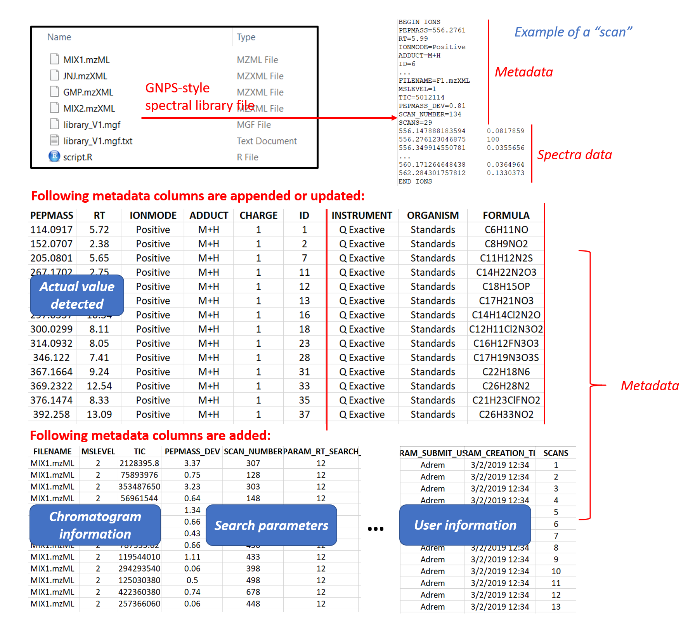
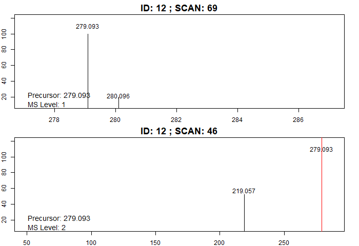

```{r  biocstyle, echo = FALSE, results = "asis" }
BiocStyle::markdown() 
```

# Introduction

The datasets for Example 1 are provided by Janssen Pharmaceutica. It consists of known standard pharmaceutical compounds for which high quality Q-Exactive MS/MS data is provided. Names and structures of these compounds can be found in the metadata. All datasets were acquired in positive ion mode through either DDA (data-dependent acquisition) or targeted MS/MS. Raw data in profile mode were converted into centroid-mode mzML or mzXML files using MSConvertGUI. Please execute following commands (once only) to download raw datasets.

```R
url = "https://zenodo.org/record/2581847/files/"
original_files = c("NA_170405_MAS006_10.mzML",
                    "TESTMIX2_180504_MAS011_06.mzXML",
                    "JNJ42165279_171214_MAS006_14.mzXML",
                    "GMP_R601592_150925_MAS006_04.mzXML")
download.file(paste0(url,original_files[1]),destfile="MIX1.mzML") # Download and rename the files
download.file(paste0(url,original_files[2]),destfile="MIX2.mzXML")
download.file(paste0(url,original_files[3]),destfile="JNJ.mzXML")
download.file(paste0(url,original_files[4]),destfile="GMP.mzXML")

```
# Building the first spectral library: library1

```R
raw_data_files = c("MIX1.mzML","MIX2.mzXML","JNJ.mzXML")
#metadata_file = "https://raw.githubusercontent.com/daniellyz/MergeION/master/inst/library_metadata.csv"
metadata_file = "library_metadata.csv"

mslevel = c(1,2) # Both MS1 and MS2 scans are extracted!
MS2_type = c("DDA","DDA","Targeted") # Mode of MS/MS experiment for the three files
adduct_type = c("Default") # Only looking for default ion types (ion types provided by users in metadata)
max.charge = 1

isomers = F # If isomers are present, only the peak with higher TIC is extracted.
normalized = T
rt_search = 12 # Retention time tolerance (s)
ppm_search = 10  # Mass tolerance (ppm)
baseline = 1000  # Baseline level 1000 is fixed for 3 datasets.
relative = 1 # Relative intensitiy level 1% is fixed. All peaks under both baseline and relative level are considered as noise.

write_files = F # The library(mgf) and metadata will not be writen in user's folder
input_library = "" # A brand new library, there's no previous dependency
output_library = "library_V1.mgf" # Name of the library
user_name = "Adrem" # User name for uploading

# Generating the spectra library:
library1 = library_generator(raw_data_files, metadata_file, mslevel, MS2_type, isomers, adduct_type, max.charge, rt_search, ppm_search, baseline, relative, normalized, user = user_name, write_files, input_library, output_library)

library1 = library1$complete # Important! We extract the library object. "$complete" for extracting the entire library including historical mass spectra. Here since we create a brand-new library, "library1$complete" and "library1$current" are the same. 

```
# Writing library files

```R
# Writing the library (.mgf):
output_library = "library_V1.mgf" 
writeMGF2(library1,output_library) 

# Writing metadata:
output_metadata = paste0(output_library,".txt") 
write.table(library1$metadata,output_metadata,col.names = T,row.names=F,dec=".",sep="\t")
```
Two files are added in the working directory: 1) The library file "library_V1.mgf". The library format is inspired from GNPS database (https://gnps.ucsd.edu/ProteoSAFe/static/gnps-splash.jsp) and it consists of both metadata and spectra data. The "scans" are copies of MS1/MS2 spectra detected in raw LC-MS/MS files together with user-provided metadata. For MS1 scans, only the part of spectrum where isotopic patterns are located is saved. Segment of spectrum that contains fragments and precursor ion are saved for MS2 scans. 2) Metadata file "library_V1.mgf.txt", a tab-separated that can be read into a matrix in Excel. It contains metadata of all targeted scans (MS1 and MS2) with additional information: 



Added metadata:
* FILENAME: from which file the metabolic feature is detected
* MSLEVEL: 1: MS1 scan or 2: MS/MS scan
* TIC: Total ion intensity of scans before normalization
* PEPMASS_DEV: Mass deviation (ppm) of precursor m/z to what is in user-provided targeted m/z
* SCAN_NUMBER: scan number in original LC-MS/MS chromatogram
* PARAM_...: parameters used to extract current scan
* PARAM_CREATION_TIME: the time when the record is added to the library
* SCANS: integer, a unique identifier for each record in the library

# Update the spectral library

Now we process and add a new data GMP.mzXML in the existing library. Following metadata are changed:

```R
raw_data_files = "GMP.mzXML"

adduct_type = c("M+H", "M+Na") # Two adduct types are now considered
MS2_type = "Targeted"
isomers = T # We would like now to record all isomers in the library

write_files = T # We want to directly write the library mgf + metadata files
input_library = library1
output_library = "library_V2.mgf"
user_name = "Daniel"

library2 = library_generator(raw_data_files, metadata_file, mslevel, MS2_type, isomers, adduct_type, max.charge, rt_search, ppm_search, baseline, relative, normalized, user = user_name, write_files, input_library, output_library)

```
Two new files should appear in the working directory that contain historical and updated scans: 1) Library file "library_V2.mgf". 2) "library_V2.mgf.txt".

```R
# Extract and newly added scans:

tmp_library = library2$current

# Now we check in the newly added scans whether the desired precursor mz is in: 

query = library_manager(tmp_library, query = c("PEPMASS = 478.096"), ppm_search = 20)

library_visualizer(query)

# Summary of newly-added spectra:

library_reporter(library2$current)

# Summary of entire updated spectra library:

library_reporter(library2$complete)

# From now on, library2 is the entire library:

library2 = library2$complete 

```

# Searching the library

Searching in the raw data Mix2 the precursor mass 279.094:

```R
# We first query scans of the precursor mass detected in MIX2 from library2:
query = library_manager(library2, query = c("PEPMASS = 279.094", "FILENAME=MIX2.mzXML"), logical = "AND", ppm_search = 20)

# Create a summary of compound found:
library_reporter(query$SELECTED)

# ID (structure) of compounds selected:
id_found = query$ID_SELECTED

# Visualized spectra of the first compound (ID) found:
library_visualizer(query$SELECTED, id = id_found[1])

# Visualized compound (ID) by compound the spectra found:

for (id in id_found){
 library_visualizer(query$SELECTED, id = id)
}

```


# Managing the library

The mass 279.094 is detected in both MIX1 and MIX2. We can remove the scans in MIX2 from the library by creating a new library WITHOUT scans found:

```R
library3 = query$LEFT
library_reporter(library3)
```
